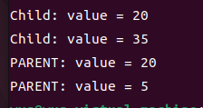
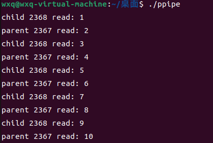
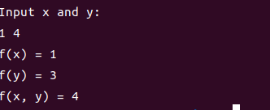

# oslab 03

网络2302 王小庆 20232241098

## `fock1.c`

输入代码并观察结果：



父进程进入 `for` 循环，此时 `i = 0` ，父进程创建一个子进程，称为子进程1。此时父进程进入 `else if` 分支，在 `wait(NULL)` 处阻塞，等待子进程1结束。
子进程1进入 `if` 分支，`value` 加15变成20，打印出 `Child: value = 20`，第一次 `for` 循环结束，`i` 自增一次变成1
第二次 `for` 循环，子进程1创建一个子进程，称为子进程2，子进程1变成父进程，进入 `else if` 分支，在 `wait(NULL)` 处阻塞，等待子进程2结束
子进程2进入 `if` 分支，`value` 加15变成35，打印出 `Child: value = 35`，第二次 `for` 循环结束，`i` 自增一次变成2，不满足 `for` 循环条件，循环结束，子进程2结束
子进程1阻塞终止，打印 `PARNET: value = 20`，子进程1结束，父进程阻塞终止，打印 `PARNET: value = 5`

如果没有 `exit(0)`，则子进程1作为父进程不会立刻退出，子进程1的第一次 `for` 循环结束，`i` 自增变成2，不满足 `for` 循环条件，循环结束
父进程也不会立刻退出，`i` 自增一次变成1，创建新的子进程，称为子进程3。此时父进程进入 `else if` 分支，在 `wait(NULL)` 处阻塞，等待子进程3结束。
子进程3进入 `if` 分支，`value` 加15变成20，打印出 `Child: value = 20`，第一次 `for` 循环结束，`i` 自增一次变成2，，不满足 `for` 循环条件，循环结束，子进程3结束
父进程阻塞终止，打印 `PARNET: value = 5`，父进程结束，父进程阻塞终止，打印 `PARNET: value = 5`

## 管道





### 独立实验

```c
#include <stdio.h>
#include <stdlib.h>
#include <sys/types.h>
#include <unistd.h>

int fx(int x) {
    if (x == 1)
        return 1;
    return x * fx(x - 1);
}

int fy(int y) {
    if (y == 1 || y == 2)
        return 1;
    return fy(y - 1) + fy(y - 2);
}

int main() {
    pid_t pid_fx, pid_fy;
    int x, y;
    printf("Input x and y:\n");
    scanf("%d %d", &x, &y);

    // 创建第一个子进程计算 f(x)
    pid_fx = fork();
    if (pid_fx == 0) {
        printf("f(x) = %d\n", fx(x));
        exit(0);
    }

    // 创建第二个子进程计算 f(y)
    pid_fy = fork();
    if (pid_fy == 0) {
        printf("f(y) = %d\n", fy(y));
        exit(0);
    }

    wait(NULL);
    wait(NULL);

    printf("f(x, y) = %d\n", fx(x) + fy(y));

    return 0;
}
```

### 运行结果

git链接https://github.com/Sanqimo/oszuoye/tree/0b73d5079c654f1e5a328e04df16aa397912db22/%E6%89%80%E6%9C%89%E4%BD%9C%E4%B8%9A