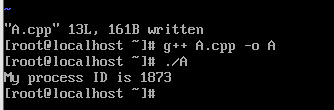
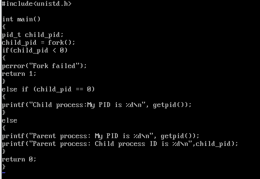
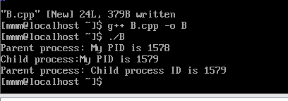
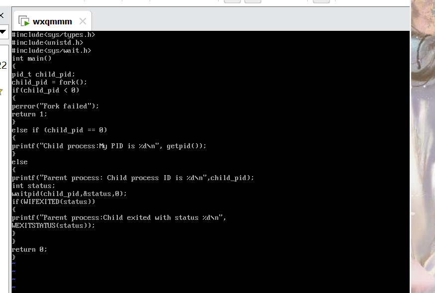
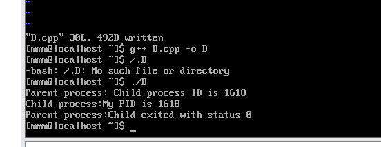
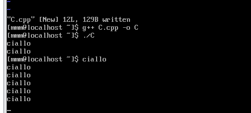
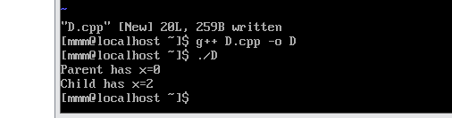

## 1.获取进程ID

### 1.  编写以下代码

在 `A.cpp` 中写入如下代码：

```cpp
#include<stdio.h>
#include<sys/types.h>
#include<unistd.h>

int main()
{
    pid_t my_pid;
    my_pid = getpid();
    printf("My process ID is %d\n", my_pid);

    return 0;
}

```

### 2.编译并运行

结果如下图所示



由此可见，当前程序的进程号（PID）为 1873。


## 2.父子进程

### 1. 编写代码

编写代码如下

```cpp
#include <stdio.h>
#include <sys/types.h>
#include <unistd.h>

int main()
{
    pid_t child_pid;
    child_pid = fork();
    if (child_pid < 0)
    {
        perror("Fork failed");
        return 1;
    }
    else if (child_pid == 0)
    {
        printf("Child process:My PID is %d \n", getpid());
    }
    else
    {
        printf("Parent process: My PID is %d \n", getpid());
        printf("Parent process: Child process ID is %d \n", child_pid);
    }
    return 0;
}
```




### 2. 编译并运行程序  

得到的结果如下图所示




## 3父进程等待子进程退出测试

### 1.修改代码

输入代码如下

```cpp
#include <stdio.h>
#include <sys/types.h>
#include <unistd.h>
#include <sys/wait.h>

int main()
{
    pid_t child_pid;
    child_pid = fork();
    if (child_pid < 0)
    {
        perror("Fork failed");
        return 1;
    }
    else if (child_pid == 0)
    {
        printf("Child process:My PID is %d \n", getpid());
    }
    else
    {
        printf("Parent process: Child process ID is %d \n", child_pid);
        int status;
        waitpid(child_pid, &status, 0);
        if (WIFEXITED(status))
        {
            printf("Parent process: Child exited with status %d\n", WEXITSTATUS(status));
        }
    }
    return 0;
}
```

如图所示



### 2.运行这个代码

得到结果如下


结果显示：  
父进程在调用 `waitpid()` 后进入等待状态，直至子进程退出后才继续执行后续代码。子进程正常退出（退出状态为 0），并且父进程通过 `WIFEXITED` 与 `WEXITSTATUS` 检查子进程的退出状态。  

## 4.多次 fork() 进程创建实验

### 1.编写代码

编写代码如下

```cpp
#include<stdio.h>
#include<sys/types.h>
#include<unistd.h>

int main()
{
    fork();
    fork();
    fork();
    printf("ciallo\n");
    return 0;
}
```

### 2. 编译并运行

发现结果如下图所示


这表明：每次调用 `fork()` 后，当前进程都会复制出一个新的进程。程序共输出 8 次 `ciallo`，验证了进程复制的倍增效果。

## 5进程独立性实验

### 1.编写代码

编写代码如下

```cpp
#include <stdio.h>
#include <sys/types.h>
#include <unistd.h>
#include <stdlib.h>

int main()
{
    int x = 1;
    pid_t p = fork();
    if (p < 0)
    {
        perror("fork fail");
        exit(1);
    }
    else if (p == 0)
        printf("Child has x = %d \n", ++x);
    else
        printf("Parent has x = %d\n", --x);

    return 0;
}
```

### 2. 运行代码

编译并运行得到结果如下

